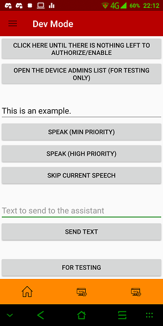
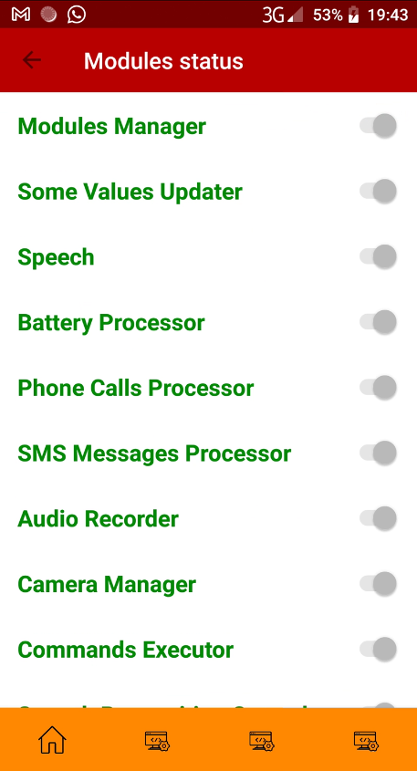
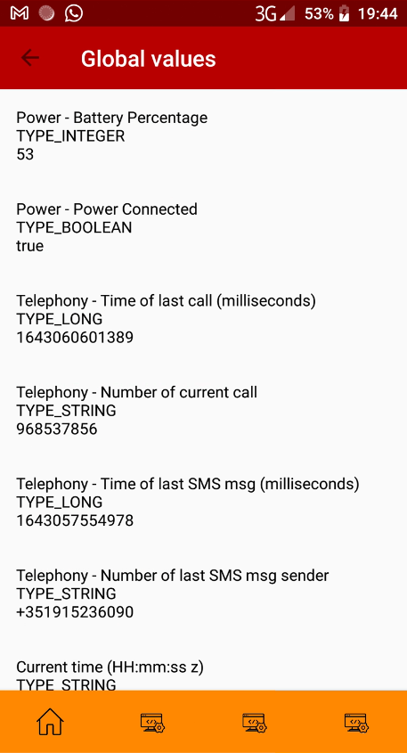
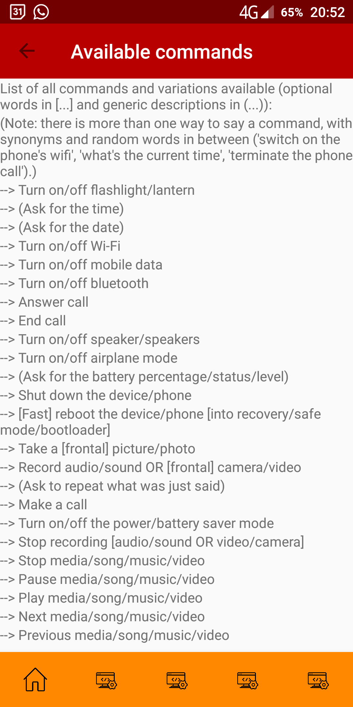

# V.I.S.O.R. - A better Android assistant
Secondary project name: Assist_C_A (Assistant Client Android)

## Notice
This project is a part of a bigger project, consisting of the following:
- [V.I.S.O.R. - A better Android assistant](https://github.com/DADi590/VISOR---A-better-Android-assistant)
- [V.I.S.O.R. - Server Version Assistant](https://github.com/Edw590/VISOR---Server-Version-Assistant)

## Download
Currently there are only pre-releases, but they're functional - I use the app on my phone, running all the time, 24/7. Download any (preferably the most recent one) from the [Releases](https://github.com/DADi590/VISOR---A-better-Android-assistant/releases), clicking on Assets.

They say "debug" at the end because they're debug type APKs, meaning you can use Android's logcat to look at what's happening on the app. They're not release type, in which you can't see anything. As they're pre-releases, I'm releasing them as debug type. Why not, anyway.

They're pre-releases because I don't have any settings yet. So everything is how I programmed it and can't be changed. When I have a settings page I might start releasing the versions as actual releases.

## Test Android versions and devices (in order of use)
- Oreo 8.1 on a Blackview BV9500 (most used to test - my current phone). This is also the Android version I'm making the app for (can't test it on newer than 8.1 anyway) - though I think most of the app (or everything) works on newer versions due to backwards compatibility, so feel free to install it on newer Android versions.
- KitKat 4.4.2 on my Wolder miTab Advance tablet
- Ice Cream Sandwich 4.0.3 on the Android Studio Emulator
- Lollipop 5.0 on a OnePlus X (the phone with the broken screen that gave reason to the app)

## Pictures
Note: these pictures may be outdated.

**NOTE: the commands list picture is outdated. Check below for a complete list.**



## Table of Contents
- [Background](#background)
- [Explanation of the assistant](#explanation-of-the-assistant)
- [Commands list](#commands-list)
- [Current features (modules and submodules)](#current-features-modules-and-submodules)
- [Installation/Usage](#installationusage)
- [For developers](#for-developers)
- - [To compile the app](#--to-compile-the-app)
- [About](#about)
- - [Roadmap](#--roadmap)
- - [Project status](#--project-status)
- - [License](#--license)
- [Support](#support)
- [Final notes and contributing](#final-notes-and-contributing)

## Background
Hi all. This Android version is a project I started in January 2020 when I broke my phone's screen and glass (so I could see and do exactly nothing with the screen and touch - only Vysor and TeamViewer helped/help, but only with a PC nearby) - the PC version started in 2017 a month after I learned what programming was, but it's too no-code to publish XD (I didn't know what a function was by then...). Anyways. As I wasn't gonna switch phone so quickly (bought a new one a year later), I decided to make an assistant for it that would do anything I'd need without the need for me to have a working screen and touch (basically an app for a blind person, I guess). Could only use the Power, Vol Up and Vol Down buttons.

I've now finally decided to make it public, after vastly improving its coding style (<3 IntelliJ's Inspections...) and translating the code to English (was in Portuguese, even though speeches and recognition were already in English).

"A better Android assistant" because it's supposed to help handling the phone, even if it has no screen (my original use for the app with an older phone of mine with a broken screen), or even in the future, with time, one of the ideas is to have it knowing exactly where the user is (**no sharing of anything, all local** - everything will be only local when I create the file to store them) to remind them of something they might need to do (leaving the house, good idea to bring the wallet and the keys, for example. Or going near a supermarket - "You wanted to buy food"). It's all open-source code, so... nothing bad in the background. Don't really trust? - check the code and compile yourself and use it (same app anyways).

## Explanation of the assistant
Its command recognition submodule is not a simple recognition (have a look on the Advanced Commands Detection module mentioned below in the Notice) - you don't have to say the exact command for it to recognize it. It's not smart either though (it's not ML - yet?). You can say any words in-between some hard-coded command words and it will still recognize the action(s). You can even tell it to don't do something you just told it to do. It's supposed to be an assistant for real-life use.

It's also supposed to work 100% offline. It can use online features, but preferably, only if they're not available offline. If Internet connection goes down, app goes down - doesn't seem a good idea... xD

For now it's also an app that has everything hard-coded, so no options to customize in the UI. Feel free to change whatever you'd like and use it yourself, for example. If I decide to publish it on some store, an UI will be made for users to be able to choose as many things as I can make choosable - or with time, even if I don't publish it (for now I'd just like everything implemented and working).

I should also note that I'm making this app to "think" it's a God. That's why you might see some "abusive" parts on it, like my code ready to force permissions to be granted (though, disabled until I have a way to make it optional). It's supposed to be as secure as I can make it. Check it for yourself though. It has nothing that steals data (decompile the APK if you want, there are tools online for that; or compile it yourself). I might try to keep the app without the Internet permission if I release it to a store, so people can be relaxed about it (it will probably cut features if I do it though).

The app "supports" API 15 at minimum (that's Android 4.0.3). That's because I like to support as many devices as I can (GoMobile, a library I'll use, is only available from API 15 onwards).

The app is also able to work with root access and system permissions. The prefered way to install the app is with root permissions, installed as a privileged system app, and Device Administration enabled for it (absolute control XD). The app must work without them perfectly, but if some features are *only* available with one or more of the 3 mentioned ways, they will be added anyways. So to have full functionality, install it that way.

## Commands list
List of all commands and variations available (optional words are in "[...]" and generic descriptions are in "(...)").

(Note: there is more than one way to say a command, with synonyms and random words in between ("switch on the phone's wifi", "what's the current time", "terminate the phone call", "call my friend number 2" (when the contact is just called "friend 2").)

Note 2: all this is listed inside the app.

```
--> Turn on/off flashlight/lantern
--> (Ask for the time)
--> (Ask for the date)
--> Turn on/off Wi-Fi
--> Turn on/off mobile data
--> Turn on/off bluetooth
--> Answer call
--> End call
--> Turn on/off speaker/speakers
--> Turn on/off airplane mode
--> (Ask for the battery percentage/status/level)
--> Shut down the device/phone
--> [Fast] reboot the device/phone [into recovery/safe mode/bootloader]
--> Take a [frontal] picture/photo
--> Record audio/sound
--> (Ask to repeat what was just said)
--> Call (a contact name)
--> Turn on/off the power/battery saver mode
--> Stop recording [audio/sound]
--> Stop media/song/music/video
--> Pause media/song/music/video
--> Play media/song/music/video"
--> Next media/song/music/video
--> Previous media/song/music/video
--> I do/confirm/approve/certify (confirm action when VISOR requests it)
--> I don't/reject/disapprove (reject action instead)
```

## Current features (modules and submodules)
Here's a list of the modules the assistant currently have and what they do (module names are in bold for ease of read):
- **[Advanced Commands Detection](https://github.com/DADi590/Advanced-Commands-Detection)** --> Detects commands in a sentence of words (a link because it's in another repository). It's the module that understands the user communication (voice or text - as long as it uses words). It can detect no so simple sentences of multiple commands, and understands the meaning of "don't", "it", and "and". Example of a complex sentence it can successfully understand (without the punctuation - it must not be present): `"turn it on. turn on the wifi, and and the airplane mode, get it it on. no, don't turn it on. turn off airplane mode and also the wifi, please."` (ignores/warns about the meaningless "it", turns on the Wi-Fi, and turns off the airplane mode and the Wi-Fi).
- **Device Locator** --> This module is responsible for locating the device as best and accurately as it can, both absolutely (like GPS coordinates or knowing the user is in their house because the Wi-Fi SSID and MAC is at reach) and/or relatively (the user's computer is near the mobile device, wherever that is). It uses any means necessary and available (both by hardware and app permissions). For example as of this writing, it's checking the current type of network (if any), getting the public IP address (if connected to the Internet), and detecting nearby Bluetooth devices and Wi-Fi Access Points (networks) - it enables the Wi-Fi and the Bluetooth from time to time, but it won't connect to any device or network. If the device attempts to connect to any BT device or Wi-Fi AP, VISOR instantly either disconnects before it connects, or disables the adapter if it can't just disconnect. Though, more will be added with time (GPS, BLE, and whatever more I find that can be used to locate the device.
- **Speech Recognition** --> This is a module which contains 2 different speech recognizers: the commands one and PocketSphinx from the CMUSphinx project. PocketSphinx is used for hotword recognition (to call the assistant by saying his name - it's not very accurate unfortunately, but there's really nothing I can do about it), which then calls the commands speech recognition (the default one of the device - like Google or Samsung's) to recognize normal speech (very good accuracy, and in which you can say commands, like "turn on the wifi and the bluetooth and what time is it"). You can also call the commands recognizer directly by pressing and holding the Power key while the screen is on, on Android versions up to Pie (Android 9) or by holding the Home button (if you set VISOR as the default) or still by holding the headset button (if you set VISOR as default).
- **Audio Recorder** --> Records audio from a given audio source (like phone calls, microphone...). The audio will be recorded in background and in a good quality, and will be saved to a folder in the external storage, named VISOR. No notifications, nothing. And in case of an error, "Error 1/2/3/4" only will be said. Nothing related to being recording...
- **Camera Manager** --> Manages the camera usage. It's supposed to be able to record videos (not yet), take pictures (only on Android KitKat and below for now), and toggle the flashlight (ready).
- **Battery Processor** --> Processes the device battery level and warns if it's outside of normal ranges. For now, 5% or below, extremelly low battery; 20% or below, low battery; above 80%, battery charged enough to the recommended Lithum-Ion batteries percentage (from 20% to 80%, and varying as little as possible); 100%, battery completely charged.
- **Telephony Manager** --> Keeps an internal list of all phone contacts updated to be used for command detection. The list is being updated every 10 seconds.
- - Note: everything here that need to get the contact name of a phone number will do it like this. If the phone number is only numeric (like +351 123 456 789 in case of Portugal), it will get the name related to that number. If the "number" has letters on it, it will warn it's an alphanumeric number (like "PayPal"). If it's a private number, it will say it's a private number. If it found different names for the same phone number, it will warn it detected multiple matches on that number.
- - **Phone Calls Processor** --> Processes any phone calls made by and to the phone and warns about incoming, waiting and lost calls, currently. For now, sometimes it may warn that a call was lost only after all calls have been terminated - that's a problem of the current implementation of the call state detection, which shall be improved some time (could take some time, as it's not a big deal to me).
- - **SMS messages Processor** --> Processes any messages received on the phone and warns who is sending the message (it won't say what the message is - if I implement that, I'll have to put that to a limited list or something. I won't put it to all contacts).
- **Speech module** --> Gets the assistant to speak. It can have customizable priorities (currently, Low, Medium, User Action, High and Critical) and can skip speeches. Some important notes here:
- - About the Critical priority: it will take your phone out of Do Not Disturb mode, get it to full volume, and say what it has to say (currently only if you disable the Device Administration Mode).
- - Another important thing is: the assistant will NOT speak if the phone's ringer mode is not the Normal one (which means, only if you have sound enabled for calls and messages). If it's on Vibrating or Do Not Disturb, it won't speak - unless again, Critical speech priority, which bypasses everything I found that could be bypassed to speak xD.
- - Also another notes: if you have sound enabled and the assistant speaks...
- - - It may raise your calls/messages volume to speak, and will stop other apps' audio. After it's done speaking, all will be back to normal, if anything was changed (volume, other apps' audio and Do Not Disturb) - unless it changed the volume to speak and while it was speaking, you changed it (in that case, the volume will not be touched again and will remain the one you chose).
- - - Also, on High priority and above, all speeches will be spoken in both speakers and headphones. Below High, either headphones or speakers will be used, not both.
- **Protected Lock Screen** --> [NOT READY] An alternate lock screen that is supposed to mimic ESET Mobile Security's lock screen on version 3.3 - it would lock users out of the normal one and let them do nothing until they inserted the correct code or, in case Internet connection was available, the device was removed from the protected mode in ESET's Anti-Theft website. If you'd like to see it working, give the app Device Administration privileges and then attept to remove them (you can remove, of course - you just need to dismiss the screen that will appear twice: first when you try to disable, and second when you actually disable). The supposed only way to get back to the device (without restarting - didn't take care of that yet) is to click Unlock.

Note: not all the modules that appear on Modules Status are here. Some are just for internal management (like Modules Manager, which makes sure all the other modules are working perfectly - this is not really a "feature", so I didn't include it above) or any other minor things.

## Installation/Usage
Install the app either as a perfectly normal app, or as a privileged system app (below KitKat 4.4, in /system/app; on 4.4 and above, in /system/priv-app/). Grant it root access, if you'd like, and also enable Device Administration for it, if you want. Privileged system app + root access + Device Administration will give you full functionality of the app.

After that, currently just click on the permissions button and accept everything (or what you'd like to accept - though I'm not/will not steal anything, so you can accept everything, if you want), and that's it. The app will do everything automatically (there's not much to do manually with it yet - only recording audio is manual for now).

To know what you can do, have a look on the Available commands view on the app. To know what the app can do, have a look on the explanations about its features.

## For developers
### - To compile the app
- I'm not sure if other IDEs other than Android Studio can be used to compile an Android app, but that's the one I used. So if you want, use it too.
- Also, to be able to compile this app, you'll need hidden/internal APIs available on Android Studio, or it will throw errors. I decided to compile this app with those libraries since they allow some interesting and useful things to be used here. Have a look here to download and install those libraries: https://github.com/anggrayudi/android-hidden-api and/or https://github.com/Reginer/aosp-android-jar.
- Another thing needed to run the app without signing it with my certificate is to go to UtilsMainSrvc and comment the signature/app corruption check on startMainService().
- I have may also private constants and stuff used on the app (for example MAC addresses, or might have phone numbers), which are in files excluded from Git. Those things must be replaced when compiling the app. Hopefully the variable/constant name should help. If it does not, just tell me and I'll explain it (and improve for next time).

Now a small explanation of the app structure:
- All modules are inside the Modules folder. Each module has a folder of its own and all directly related things to it should be on that folder. All modules must also be registered in the ModulesList.java file.
- All utility methods are inside classes started with "Utils". All main utilities are on GlobalUtils. Other utilities may be one specific packages of modules or other folders (depending if the utilities are for global app usage or only for that specific package).
- The main broadcast receivers are on BroadcastRecvs package. I say "main" because other broadcast receivers may be anywhere else on the app code. For example inside classes, like on Speech2 or on MainSrv.
- All modules must implement the IModule classes, which provide "universal" methods to check if a module is working properly or not so that Module Manager can reset it if needed.
- The VoiceEnrollment and VoiceInteraction folders are just experiments of mine to get Google's hotword recognizer to work (which would make it possible to use Google's speech recognition instead of the current PocketSphinx speech recognition, which is worse than Google's, and that's why when VISOR is called, it may not hear it, as opposite to if it were Google's recognition detecting the hotword).

## About
### - Roadmap
Have a look on the "TODO.md" file (note: it's not always updated. But it has some things there).

### - Project status
Ongoing, but possibly slowly since I'm a student, so I may not have that much time to work on this (even though I'd love to have more time) - except on Holidays xD.

### - License
This project is licensed under Apache 2.0 License - http://www.apache.org/licenses/LICENSE-2.0.

## Support
If you have any questions, try the options below:
- Create an Issue here: https://github.com/DADi590/VISOR---A-better-Android-assistant/issues
- Create a Discussion here: https://github.com/DADi590/VISOR---A-better-Android-assistant/discussions

## Final notes and contributing
Hope you like the app! Any new ideas and/or improvements are welcomed! (Just giving the idea and/or making a pull request)
